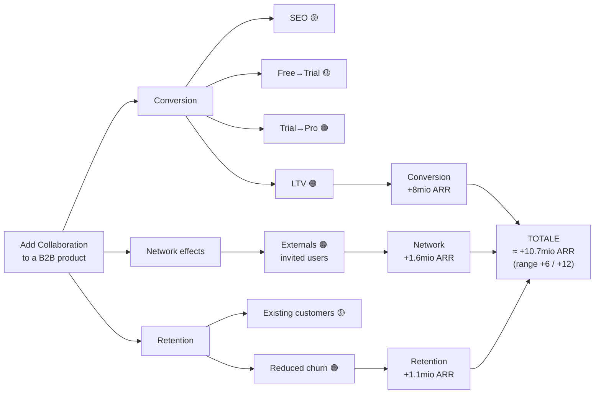

# Output Templates

Tre formati. Produci sempre **(3) one-pager** come minimo; aggiungi **(1)** e **(2)** per il caso
completo. Mantieni i colori 🔴🟡🟢 sui driver: comunicano a colpo d'occhio dove sei incerto.

---

## (1) Doc markdown completo

```markdown
# Business Case — [Nome opportunità]

**Contesto**: [tipo: feature prodotto / iniziativa GTM / deliverable cliente]
**Assunzione centrale**: [una frase]
**Soglia minima**: [es. >10% ARR = >5mio] · **Gate strategico**: [table stake / differentiator / debt]

## 1. Draft
- Canali toccati: [canale A, B, C]
- Upside grezzo iniziale: [+Xmio] → supera/non supera la soglia

## 2. Breaking it up (albero + color)
[diagramma mermaid — vedi sezione (2), oppure albero ASCII]
- 🟢 [driver]: [perché]
- 🟡 [driver]: [perché]
- 🔴 [driver]: [perché — è una scommessa]
- Eliminati nel sense-check: [driver scartati e perché]

## 3. Impact / Confidence / Effort
| Driver | Impact | Confidence | Note |
|---|---|---|---|
| [driver] | High/Med/Low | 🟢/🟡/🔴 | [evidenza dietro] |
- **Effort**: Difficult vs Complex → [stima]. Milestone: [se high-cost]

## 4. Value Capture
| Canale | Catena di calcolo | Upside |
|---|---|---|
| [canale] | [utenti → % → % → LTV × 12] | +[X]mio |
| **Totale** | | **+[X]mio** |
- **Range comunicato**: +[basso]mio – +[alto]mio ARR
- **Risk-adjusted** (~conf. media): ~[X]mio
- **% dell'ARR**: [X]% · **Strategic fit**: [sì/no, perché]

## 5. De-risking
- **Rischio critico (a monte)**: [assunzione 🔴 che regge tutto]
- **Test**: [painted door / MVP in 1 quarter su [metrica]]
- **Kill threshold**: "Se [metrica] non raggiunge [soglia], rivalutiamo/uccidiamo."

## Raccomandazione
[Go / No-go / Go condizionato al de-risking] — [1-2 frasi]
```

---

## (2) Diagramma mermaid (canale → driver → upside)

Replica l'albero visivo di Tharin. Esempio sul caso "Collaboration":



Regole: un nodo per driver con il colore nel testo; i nodi finali di canale mostrano l'upside; il nodo
totale mostra range. Per cataloghi più grandi, usa `subgraph` per raggruppare i canali.

---

## (3) One-pager (sintesi — il formato che gira)

Deve farsi leggere in secondi. Solo impact e timeline; il ragionamento sta nei dettagli sopra.

```markdown
## [Nome opportunità] — Business Case (one-pager)

**Upside**: +6mio – +12mio ARR (≈21% dell'ARR) · risk-adjusted ~7mio
**Da 3 canali**: Conversion (+8mio) · Network effects (+1.6mio) · Retention (+1.1mio)
**Gate**: differentiator · **Strategic fit**: risolve il problema LTV

**Effort**: ~4 quarter (1 team) — Complex (mai fatto, tocca mktg/growth/sales)
**Rischio critico**: il +25% di conversione (🔴) regge ~8mio e, a cascata, il network effect
**De-risk**: MVP in 1 quarter sul free→trial · **Kill threshold**: <+15% conversione → stop

**Raccomandazione**: GO condizionato al superamento del kill threshold nell'MVP.
```

---

## Note di confezionamento

- **Comunica in range**, mai numero secco (vale per tutti e tre i formati).
- **Problema-ICP, non feature**: nel titolo e nella raccomandazione punta al problema risolto, non
  alla feature ("riduciamo il churn dei team" > "aggiungiamo la collaborazione").
- **Marca i 🔴 come domande aperte**, non come fatti. Sono ciò che il lettore deve poter sfidare.
- Se l'utente vuole un visual ricco (slide/infografica) invece del mermaid → passa a
  `infographic-creator`. Se vuole il deck commerciale → `sales-deck-creator`.
